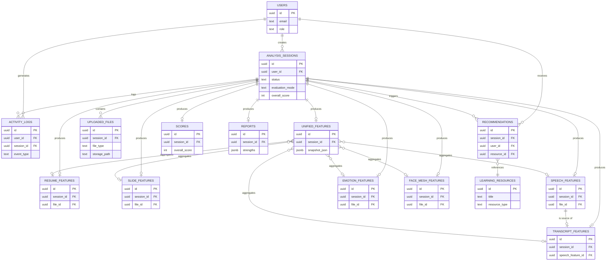
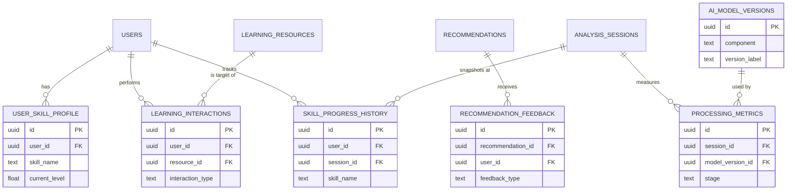

# FutureReady — Entity Relationship Diagram (ERD) Design

**Document type:** Database architecture design (ERD only — no ORM models, no migrations, no SQL, no CRUD code)
**Target implementation stack:** PostgreSQL 15+ / SQLAlchemy 2.x (future work, not part of this document)
**Scope:** Full intended FutureReady platform — upload → extraction → AI analysis → feature fusion → deterministic scoring → recommendation → prompt building → Gemini reasoning → report, plus the persistence needed to support a future TensorFlow-Recommenders-based recommendation engine without a schema rewrite.

---

## 0. Design Rationale — Merge / Split Decisions

Before presenting the final ERD, four non-obvious design decisions are called out and justified, because each one trades relational purity against operational practicality.

**0.1 — `ResumeFeatures` and `SlideFeatures` merge raw extraction with deterministic analysis into one row each.**
The pipeline conceptually separates Layer 1 (raw extraction: PyMuPDF / python-pptx output) from Layer 2 (deterministic analysis: keyword density, structure balance, etc.). Architecturally these are two different services, but relationally they are always **1:1 with the same session**, always produced in the same request, and always consumed together by the Scoring Engine and Prompt Builder. Splitting them into four tables (`resume_features` + `resume_analysis` + `slide_features` + `slide_analysis`) would double the join count on every read path for no query-pattern benefit, since nothing ever needs "extraction without analysis." They are kept as two tables (`resume_features`, `slide_features`), each with two clearly labeled column groups (`extraction_*` and `analysis_*`). **Alternative considered:** if Layer 2 heuristics are expected to be re-run independently and frequently (e.g. re-scoring an old resume after a scoring-formula update, without re-uploading the PDF), split them. This is flagged again in §7 (Normalization Discussion) as a reversible decision.

**0.2 — `SpeechFeatures` merges acoustic signal features (Librosa) with Whisper's transcription metadata.**
Both originate from the same audio file, are computed in the same pipeline stage, and are always 1:1 with the session. `TranscriptFeatures` is kept as its own table because it operates on **text**, not audio, has a materially different consumer (linguistic scoring vs. vocal-delivery scoring), and — critically — is the one feature table that could someday be recomputed from a corrected/edited transcript without re-running Whisper. That reprocessing path is the reason it earns its own table while acoustic+ASR-metadata do not.

**0.3 — `UnifiedFeatures` is a real, persisted table, not a database view.**
A view recomputed on every read would (a) require re-joining six optional tables on every prompt-build, and (b) silently change its output if any upstream feature row were later edited or re-processed — breaking the platform's core guarantee that **scores must be reproducible**. Instead, `unified_features` is materialized once, at fusion time, with FK pointers to whichever component tables were present *and* a `snapshot_json` column holding the exact merged payload that was actually fed into the Scoring Engine and Gemini prompt. This makes every historical report byte-for-byte reproducible even if the live feature tables are later reprocessed with improved extractors.

**0.4 — All eleven pipeline-stage tables hang directly off `analysis_sessions`, not off each other in a chain.**
An earlier draft chained tables (`resume_features → resume_analysis → unified_features → scores → reports`). This was rejected: a broken or delayed stage (e.g. Whisper still running) would leave downstream FKs dangling or nullable in confusing ways, and a "get everything for this session" query would require a deep, order-dependent join chain. Instead this ERD uses a **star topology**: `analysis_sessions` is the aggregate root, and every stage-output table has its own `session_id` FK back to it. This makes partial pipeline states (e.g. extraction done, scoring not yet run) trivial to represent — the corresponding rows simply don't exist yet — and every table is independently queryable with a single join.

---

## 1. High-Level ER Diagram

### 1.1 Core platform (15 MVP entities)

### 1.2 Future-expansion entities (6 optional modules)

---

## 2. Core Modules — Detailed Entity Descriptions

### 2.1 `users`
- **Purpose:** Identity anchor for every session, recommendation, and log entry. Even though authentication is out of scope for the current backend build, every other table's ownership chain depends on a stable user identity, so this table is foundational infrastructure, not a "future" add-on.
- **Primary Key:** `id` (UUID)
- **Important fields:** `email` (unique), `display_name`, `password_hash` (nullable — populated once auth is built; NULL supports SSO-only accounts), `role` (`student` / `admin`), `preferred_language` (`vi` / `en`, matches the API's `language` parameter), `created_at`, `updated_at`
- **Foreign Keys:** none (root entity)
- **Relationships:** 1:N `analysis_sessions`, 1:N `activity_logs`, 1:N `recommendations`
- **Why this table exists:** Every downstream artifact (a session, a score, a recommendation) must be attributable to a person for history, personalization, and access control — without it, "show me my last 5 evaluations" has no anchor.

### 2.2 `uploaded_files`
- **Purpose:** Records every file a user submits (resume/slide/speech/video), independent of whether that file is later reprocessed, kept, or purged.
- **Primary Key:** `id` (UUID)
- **Important fields:** `file_type` (enum: `resume`/`slide`/`speech`/`video`), `original_filename`, `storage_path` (nullable — set to NULL once the temp file is cleaned up, matching the current backend's auto-delete-after-processing behavior, while the row itself is retained for audit), `mime_type`, `size_bytes`, `checksum_sha256`, `status` (`uploaded`/`processing`/`processed`/`failed`/`purged`), `uploaded_at`
- **Foreign Keys:** `session_id → analysis_sessions.id`
- **Relationships:** N:1 `analysis_sessions`; referenced (optionally) by each Layer-1 feature table via `file_id`
- **Why this table exists:** Decouples "what the user submitted" from "what was extracted from it." This is what lets the platform answer questions like file-size trends, format-rejection rates, or checksum-based dedup, none of which belong inside a feature table.

### 2.3 `analysis_sessions`
- **Purpose:** The aggregate root of one evaluation run — one row per call to `/evaluate` (Mode A: raw files, or Mode B: pre-built `UnifiedFeatureModel`). Every other pipeline-stage table hangs off this table's `id`.
- **Primary Key:** `id` (UUID)
- **Important fields:** `evaluation_mode` (`files` / `unified_features_json`), `status` (`pending`/`extracting`/`analyzing`/`fusing`/`scoring`/`recommending`/`prompting`/`reasoning`/`completed`/`failed`), `language`, `overall_score` (**intentionally denormalized** copy of `scores.overall_score`, see §7), `error_message`, `created_at`, `started_at`, `completed_at`
- **Foreign Keys:** `user_id → users.id`
- **Relationships:** N:1 `users`; 1:N `uploaded_files`; 1:0-or-1 with each of `resume_features` / `slide_features` / `speech_features` / `transcript_features` / `emotion_features` / `face_mesh_features` / `unified_features` / `scores` / `reports`; 1:N `recommendations`; 1:N `activity_logs`
- **Why this table exists:** Without a session concept, there is no way to group "this resume + this video + this transcript" as one coherent evaluation, no natural place to track pipeline progress/failure, and no stable FK target for every downstream table — it is the backbone the entire ERD is organized around (see §0.4).

### 2.4 `resume_features`
- **Purpose:** Stores both the raw PyMuPDF extraction (Layer 1) and the deterministic resume-content analysis (Layer 2) for one session's resume.
- **Primary Key:** `id` (UUID)
- **Important fields:** *extraction:* `raw_text`, `page_count`, `word_count`, `avg_words_per_page`, `headings` (JSONB array), `skills`/`education`/`experience`/`projects` (JSONB arrays), `distinct_fonts` (JSONB array); *analysis:* `keyword_density`, `action_verb_ratio`, `quantified_achievement_count`, `section_completeness`, `contact_info_present`, `length_appropriateness`
- **Foreign Keys:** `session_id → analysis_sessions.id` (unique), `file_id → uploaded_files.id` (nullable — NULL when features arrived via Mode B)
- **Relationships:** 1:1 `analysis_sessions`; referenced by `unified_features.resume_feature_id`
- **Why this table exists:** Isolates every resume-specific signal the Scoring Engine's Resume Score formula and the Gemini prompt's resume section need, in one place, without polluting the session table with dozens of resume-only columns.

### 2.5 `slide_features`
- **Purpose:** Stores both the raw python-pptx extraction and the deterministic slide-design analysis for one session's presentation deck.
- **Primary Key:** `id` (UUID)
- **Important fields:** *extraction:* `slide_count`, `slides` (JSONB array of per-slide `{title, bullets, notes, image_count, chart_count, table_count, fonts, colors, text_length}`), `image_count`, `chart_count`, `table_count`, `fonts`/`colors` (JSONB arrays), `average_text_length`; *analysis:* `text_density_score`, `visual_richness_score`, `consistency_score`, `notes_usage_ratio`, `title_presence_ratio`, `structure_balance_score`
- **Foreign Keys:** `session_id → analysis_sessions.id` (unique), `file_id → uploaded_files.id` (nullable)
- **Relationships:** 1:1 `analysis_sessions`; referenced by `unified_features.slide_feature_id`
- **Why this table exists:** Same rationale as 2.4, for the slide-deck modality; keeping per-slide detail as JSONB (see §5) instead of a `slide_items` child table avoids twenty near-empty child rows per deck for data that is always consumed as a whole.

### 2.6 `speech_features`
- **Purpose:** Stores raw Librosa acoustic features and Whisper's transcription output/metadata for one session's audio.
- **Primary Key:** `id` (UUID)
- **Important fields:** *acoustic:* `sample_rate`, `duration_sec`, `pitch_mean_hz`/`pitch_std_hz`, `voiced_ratio`, `tempo_bpm`, `rms_mean`/`rms_std`, `mfcc_mean`/`mfcc_std` (JSONB float arrays), `chroma_mean` (JSONB), `spectral_centroid_mean`, `silence_ratio`, `silent_region_count`; *speech intelligence:* `transcript_text`, `language`, `segments` (JSONB array of `{start_sec, end_sec, text, confidence}`), `average_confidence`, `words_per_minute`, `word_count`
- **Foreign Keys:** `session_id → analysis_sessions.id` (unique), `file_id → uploaded_files.id` (nullable)
- **Relationships:** 1:1 `analysis_sessions`; 1:1 `transcript_features` (source relationship); referenced by `unified_features.speech_feature_id`
- **Why this table exists:** Everything that can be computed from the audio file alone — without any NLP over the resulting text — belongs here; it is the single source of truth for both the Speech Score and the transcript text that `transcript_features` operates on.

### 2.7 `transcript_features`
- **Purpose:** Stores the deterministic (non-LLM) linguistic analysis of the transcript produced in `speech_features`.
- **Primary Key:** `id` (UUID)
- **Important fields:** `word_count`, `sentence_count`, `vocabulary_diversity`, `repeated_words` (JSONB map), `filler_word_count`/`filler_word_ratio`, `grammar_issue_estimate`, `has_opening`/`has_body`/`has_conclusion`/`has_call_to_action` (booleans), `topic_consistency`, `estimated_cefr`, `keyword_coverage`
- **Foreign Keys:** `session_id → analysis_sessions.id` (unique), `speech_feature_id → speech_features.id`
- **Relationships:** 1:1 `analysis_sessions`; N:1 `speech_features`; referenced by `unified_features.transcript_feature_id`
- **Why this table exists:** Separated from `speech_features` specifically because it is reprocessable from corrected text alone (see §0.2) and because it feeds a conceptually distinct score (content/structure quality vs. vocal delivery).

### 2.8 `emotion_features`
- **Purpose:** Stores the HSEmotion facial-emotion analysis over sampled video frames.
- **Primary Key:** `id` (UUID)
- **Important fields:** `emotion_distribution` (JSONB map of 7 emotions → probability), `dominant_emotion`, `emotion_consistency`, `emotion_confidence_mean`, `positive_emotion_ratio`, `emotion_timeline` (JSONB array of `{timestamp_sec, emotion, confidence}`)
- **Foreign Keys:** `session_id → analysis_sessions.id` (unique), `file_id → uploaded_files.id` (nullable, video)
- **Relationships:** 1:1 `analysis_sessions`; referenced by `unified_features.emotion_feature_id`
- **Why this table exists:** Isolates the vision-model output that feeds the Emotion Score, keeping HSEmotion's per-frame timeline (naturally variable-length, time-series shaped data) out of any fixed-column table.

### 2.9 `face_mesh_features`
- **Purpose:** Stores the MediaPipe Face Mesh head-pose / gaze / blink analysis over sampled video frames.
- **Primary Key:** `id` (UUID)
- **Important fields:** `frames_analyzed`, `faces_detected_ratio`, `blink_rate_per_min`, `eye_openness_mean`, `eye_contact_ratio`, `head_pose_pitch_std`/`yaw_std`/`roll_std`, `head_movement_score`, `face_stability_ratio`
- **Foreign Keys:** `session_id → analysis_sessions.id` (unique), `file_id → uploaded_files.id` (nullable, video)
- **Relationships:** 1:1 `analysis_sessions`; referenced by `unified_features.face_mesh_feature_id`
- **Why this table exists:** Feeds the Eye Contact Score independently of `emotion_features`; kept separate because the two vision analyzers (HSEmotion vs. MediaPipe) are independently swappable/upgradable components with different output shapes.

### 2.10 `unified_features`
- **Purpose:** The materialized, reproducible snapshot of everything Feature Fusion combined for one session (see §0.3).
- **Primary Key:** `id` (UUID)
- **Important fields:** `professionalism`, `presentation_density`, `communication_confidence`, `visual_engagement`, `voice_confidence`, `presentation_readiness` (the six Layer-3 derived features, 0-100), `snapshot_json` (JSONB — the exact merged payload fed to Scoring + Prompt Builder), `fused_at`
- **Foreign Keys:** `session_id → analysis_sessions.id` (unique), `resume_feature_id`, `slide_feature_id`, `speech_feature_id`, `transcript_feature_id`, `emotion_feature_id`, `face_mesh_feature_id` (all nullable — a session need not include every modality)
- **Relationships:** 1:1 `analysis_sessions`; N:0-or-1 with each of the six feature tables; 1:1 `scores`
- **Why this table exists:** Reproducibility. Deterministic scoring is only meaningful if "what was scored" is pinned down forever, independent of later reprocessing of the underlying feature tables.

### 2.11 `scores`
- **Purpose:** The complete, immutable `ScoreBreakdown` for one session — the deterministic output of the Scoring Engine, and the one thing Gemini is contractually forbidden from producing itself.
- **Primary Key:** `id` (UUID)
- **Important fields:** `resume_score`, `slide_score`, `speech_score`, `transcript_score`, `emotion_score`, `eye_contact_score`, `voice_confidence_score`, `presentation_score`, `communication_score` (all nullable — `NULL` when the underlying material was absent), `overall_score` (never null), `scoring_formula_version`, `scored_at`
- **Foreign Keys:** `session_id → analysis_sessions.id` (unique)
- **Relationships:** 1:1 `analysis_sessions`
- **Why this table exists:** Separating scores from `unified_features` keeps "the numbers a human reads" independently auditable and versionable (via `scoring_formula_version`) from "the raw fused data," so a scoring-formula bugfix's blast radius (re-score old sessions) is a well-defined, single-table operation.

### 2.12 `recommendations`
- **Purpose:** Stores each learning-resource suggestion generated for a session, regardless of whether it came from the rule-based engine (MVP) or TensorFlow Recommenders (future).
- **Primary Key:** `id` (UUID)
- **Important fields:** `rank`, `confidence_score`, `rationale` (text), `generated_by` (`rule_engine` / `tfrs`), `status` (`suggested`/`viewed`/`accepted`/`dismissed`), `created_at`
- **Foreign Keys:** `session_id → analysis_sessions.id`, `user_id → users.id` (denormalized — see §7), `resource_id → learning_resources.id`
- **Relationships:** N:1 `analysis_sessions`; N:1 `users`; N:1 `learning_resources`; 1:N `recommendation_feedback` (future)
- **Why this table exists:** Recommendations are inherently N-per-session (a weak resume score might yield three different resource suggestions), so they cannot live as columns anywhere upstream; a dedicated table is also what lets the recommendation engine be swapped later (§8) without touching any other table.

### 2.13 `learning_resources`
- **Purpose:** The catalog of coachable content (articles, videos, courses, exercises, templates) that `recommendations` points into.
- **Primary Key:** `id` (UUID)
- **Important fields:** `title`, `resource_type` (`video`/`article`/`course`/`exercise`/`template`), `skill_tags` (JSONB array, GIN-indexed), `difficulty_level`, `url`, `source`, `duration_minutes`, `description`, `is_active`, `created_at`, `updated_at`
- **Foreign Keys:** none (root catalog entity)
- **Relationships:** 1:N `recommendations`; 1:N `learning_interactions` (future)
- **Why this table exists:** A recommendation is meaningless without a resource catalog to draw from; keeping it independent of any session lets content be curated, added, and retired without touching evaluation history.

### 2.14 `reports`
- **Purpose:** Stores the Gemini reasoning output (`ReasoningPayload`) for one session — the only table in the schema that holds LLM-generated content.
- **Primary Key:** `id` (UUID)
- **Important fields:** `strengths`, `weaknesses`, `improvement_plan`, `interview_questions`, `suggestions` (all JSONB string arrays), `presentation_feedback`, `interview_feedback` (text), `gemini_model_version`, `prompt_text` (nullable, for audit — flagged as potentially large), `raw_response` (nullable, for audit), `generated_at`
- **Foreign Keys:** `session_id → analysis_sessions.id` (unique)
- **Relationships:** 1:1 `analysis_sessions`
- **Why this table exists:** Keeps the volatile, model-version-dependent, occasionally-regenerated LLM output cleanly separated from the deterministic, reproducible `scores` table — the two have completely different mutability and versioning concerns and must never be conflated.

### 2.15 `activity_logs`
- **Purpose:** Generic, append-only audit trail for uploads, pipeline-stage transitions, errors, and (later) admin actions.
- **Primary Key:** `id` (UUID)
- **Important fields:** `event_type` (e.g. `file_uploaded`, `stage_completed`, `stage_failed`, `report_viewed`), `event_payload` (JSONB), `ip_address`, `user_agent`, `created_at`
- **Foreign Keys:** `user_id → users.id` (nullable — system-level events), `session_id → analysis_sessions.id` (nullable — user-level events not tied to a session)
- **Relationships:** N:1 `users`; N:1 `analysis_sessions`
- **Why this table exists:** Observability and debugging for an asynchronous, multi-stage AI pipeline require a durable, queryable event history independent of the business tables, which are not designed to be diffed over time.

---

## 3. Feature Storage — Separate Tables vs. JSONB vs. Hybrid

| Feature | Storage choice | Reasoning |
|---|---|---|
| `ResumeFeature` scalar fields (`page_count`, `word_count`, analysis ratios) | **Typed columns** | Directly used in `WHERE`/`ORDER BY` for the Scoring Engine and dashboards; typed columns get real indexes and constraints (`CHECK (section_completeness BETWEEN 0 AND 1)`). |
| `ResumeFeature` arrays (`headings`, `skills`, `education`, `experience`, `projects`, `distinct_fonts`) | **JSONB** | Variable-length string lists, always read/written as a whole (rendered verbatim into the Gemini prompt), never filtered element-by-element in SQL. A `text[]` array would work too, but JSONB keeps the shape self-describing and consistent with the other feature tables. |
| `SlideFeature.slides` (per-slide breakdown) | **JSONB (hybrid)** | Aggregate/summary fields (`slide_count`, `image_count`, `average_text_length`) are typed columns because they drive scoring; the per-slide array is JSONB because a "give me slide #7 across all decks" query has no real product use case, while "decks with more than 20 slides" (`slide_count`) does. |
| `SpeechFeature.mfcc_mean/std`, `chroma_mean` | **JSONB (float arrays)** | Fixed-length numeric vectors (13 MFCCs, 12 chroma bins) consumed only by the prompt builder / future ML retraining, never queried by individual coefficient. |
| `SpeechFeature.segments` / `EmotionFeature.emotion_timeline` | **JSONB (array of objects)** | Time-series data of variable length per recording; normalizing into `speech_segments` / `emotion_timeline_points` child tables would multiply row count by 10-100x per session for data that is only ever rendered as a whole timeline, never joined against other tables. |
| `TranscriptFeature`, `EmotionFeature`, `FaceMeshFeature` scalar scores | **Typed columns** | Every one of these feeds a Scoring Engine formula or a dashboard filter (e.g. "sessions with `eye_contact_ratio` < 0.4") — they must be indexable. |
| `UnifiedFeatures.snapshot_json` | **JSONB (full hybrid)** | Deliberately duplicates data already normalized elsewhere; this is not a normalization violation but an explicit audit/reproducibility cache (see §0.3 and §7). |
| `LearningResource.skill_tags` | **JSONB array + GIN index** | Many-to-many-flavored tagging without the join overhead of a `resource_tags` bridge table; acceptable because tag cardinality is small and tags are rarely renamed. If tag analytics (e.g. "top 10 tags by recommendation acceptance rate") become a first-class feature, promote this to a normalized `tags` + `resource_tags` pair — flagged as a reversible decision. |

**General rule applied throughout this ERD:** a field becomes a **typed column** the moment a scoring formula, a filter, an index, or a `CHECK` constraint needs to touch it; everything else — nested, variable-length, or "always read as a whole" — is **JSONB**. No table in this design uses a pure Entity-Attribute-Value (EAV) pattern, because every feature set has a fixed, well-documented shape (the Pydantic models already enumerate it exhaustively) — EAV would only add query complexity for schema flexibility this project does not need.

---

## 4. Recommendation Engine — Designing for a Painless Rule-Based → TFRS Upgrade

The MVP recommendation engine is rule-based (e.g. "Resume Score < 60 → recommend resume-writing resources"). The schema is designed so that swapping in TensorFlow Recommenders later requires **new rows, not new tables**:

- **User history** — every `analysis_sessions` + `scores` row *is* a historical training example (features → outcome) the moment it exists; no separate history table was needed for this.
- **Learning resources** — `learning_resources` is already the item catalog a TFRS two-tower model needs as its item-side input.
- **Recommendation feedback** — `recommendation_feedback` (future) captures explicit signal (accepted/dismissed/rated), and `learning_interactions` (future) captures implicit signal (viewed/started/completed/time-spent) — together these form the user-item interaction matrix TFRS trains on. Both reference `recommendations.id` / `learning_resources.id`, which already exist in the MVP schema.
- **Skill progression** — `skill_progress_history` (future) gives TFRS (and any future collaborative-filtering model) a time-ordered per-skill signal, letting the model learn trajectories, not just snapshots.
- **Cold-start information** — `user_skill_profile` (future) plus a new user's very first `scores` row together give a content-based fallback the moment a TFRS model has zero interaction history for that user — exactly the standard cold-start mitigation pattern.
- **Model swap-over mechanism** — `recommendations.generated_by` already distinguishes `rule_engine` from `tfrs`, and `ai_model_versions` (future) lets both engines run side-by-side (e.g. for a canary rollout or an offline A/B comparison) without an `if` statement anywhere in the schema.

No column in the MVP schema needs to be dropped, renamed, or backfilled to support this transition — the future tables are additive.

---

## 5. Future Modules — Why They're Optional for MVP

| Table | Why it's optional now | Why it exists at all |
|---|---|---|
| `user_skill_profile` | The MVP has no cross-session skill aggregation UI yet; each `scores` row is sufficient until personalization ships. | Cold-start signal and a queryable "current competency" view for a future dashboard/recommendation model. |
| `learning_interactions` | No learning-resource consumption UI exists yet (`recommendations` only *suggests*, nothing to interact with). | Implicit feedback signal required to train TFRS; must exist before the first click can be logged, but is dead weight until then. |
| `recommendation_feedback` | Same reason as above — no UI surface to collect a rating/dismissal yet. | Explicit feedback signal for TFRS training and for measuring rule-engine recommendation quality over time. |
| `skill_progress_history` | Derivable, at MVP scale, by simply querying `scores` across a user's `analysis_sessions` ordered by `created_at` — a dedicated table is a premature optimization until session volume makes that query slow. | Pre-aggregated, per-skill time series for fast trend charts once volume justifies denormalizing it. |
| `ai_model_versions` | With a single Gemini model and fixed Whisper/HSEmotion/MediaPipe versions, `reports.gemini_model_version` (a plain string column) is enough. | Becomes necessary the moment more than one model version is live simultaneously (canary rollouts, A/B tests, or reproducing an old report with an old model). |
| `processing_metrics` | Not required for correctness; the pipeline works without timing telemetry. | Operational visibility into per-stage latency/failure rate (e.g. "Whisper is the bottleneck on videos over 5 minutes") once the system has real traffic to monitor. |

---

## 6. Relationship Table

| Entity A | Cardinality | Entity B | Notes |
|---|---|---|---|
| `users` | 1:N | `analysis_sessions` | A user runs many evaluations over time |
| `users` | 1:N | `activity_logs` | Nullable on the log side for system events |
| `users` | 1:N | `recommendations` | Denormalized for direct per-user recommendation queries |
| `analysis_sessions` | 1:N | `uploaded_files` | Up to 4 files per session (resume/slide/speech/video) |
| `analysis_sessions` | 1:0-1 | `resume_features` | Present only if a resume was supplied |
| `analysis_sessions` | 1:0-1 | `slide_features` | Present only if slides were supplied |
| `analysis_sessions` | 1:0-1 | `speech_features` | Present only if audio (or a video with an audio track) was supplied |
| `analysis_sessions` | 1:0-1 | `transcript_features` | Present only if `speech_features` produced a transcript |
| `analysis_sessions` | 1:0-1 | `emotion_features` | Present only if a video was supplied |
| `analysis_sessions` | 1:0-1 | `face_mesh_features` | Present only if a video was supplied |
| `analysis_sessions` | 1:0-1 | `unified_features` | Present once Feature Fusion has run |
| `analysis_sessions` | 1:0-1 | `scores` | Present once the Scoring Engine has run |
| `analysis_sessions` | 1:N | `recommendations` | Zero or more suggestions per session |
| `analysis_sessions` | 1:0-1 | `reports` | Present once Gemini reasoning has completed |
| `analysis_sessions` | 1:N | `activity_logs` | Every stage transition and error is logged |
| `speech_features` | 1:0-1 | `transcript_features` | Transcript is derived from this row's `transcript_text` |
| `unified_features` | N:0-1 | `resume_features` / `slide_features` / `speech_features` / `transcript_features` / `emotion_features` / `face_mesh_features` | Each FK nullable; a fusion may aggregate any subset |
| `recommendations` | N:1 | `learning_resources` | Many sessions can recommend the same resource |
| `recommendations` | 1:N | `recommendation_feedback` *(future)* | A user may leave feedback on a suggestion |
| `users` | 1:N | `user_skill_profile` *(future)* | One row per tracked skill dimension |
| `users` | 1:N | `learning_interactions` *(future)* | One row per resource interaction event |
| `learning_resources` | 1:N | `learning_interactions` *(future)* | A resource is interacted with by many users |
| `users` | 1:N | `skill_progress_history` *(future)* | Time series, one row per (user, skill, session) |
| `analysis_sessions` | 1:N | `skill_progress_history` *(future)* | Each session may snapshot several skills |
| `ai_model_versions` | 1:N | `processing_metrics` *(future)* | Each pipeline-stage run references the model version used |
| `analysis_sessions` | 1:N | `processing_metrics` *(future)* | Up to ~7 rows per session (one per pipeline stage) |

---

## 7. Suggested Primary Keys

All 21 tables use a **UUID primary key** named `id`, generated application-side or via `gen_random_uuid()` / a UUIDv7-style time-ordered generator, for three reasons:

1. **No cross-service coordination needed to mint IDs** — extractors, analyzers, and the orchestrator can each generate a row's ID before insert, which matters once any stage runs as an independent worker/queue consumer.
2. **IDs are safe to expose in the API** (`EvaluationReport`, `/extract/*` responses) without leaking row-count/sequence information the way a serial integer would.
3. **UUIDv7 (time-ordered) is recommended over UUIDv4** specifically for `analysis_sessions`, `uploaded_files`, `activity_logs`, and `processing_metrics` — these are high-insert-rate, time-queried tables where a random UUID's poor B-tree index locality is most costly; the low-write catalog tables (`users`, `learning_resources`) don't need this and UUIDv4 is fine there.

Every 1:1 child table (`resume_features`, `slide_features`, `speech_features`, `transcript_features`, `emotion_features`, `face_mesh_features`, `unified_features`, `scores`, `reports`) additionally enforces a **UNIQUE constraint on `session_id`**, which is what actually guarantees the "1:0-or-1" cardinality at the database level — the surrogate `id` alone cannot do that.

---

## 8. Suggested Foreign Keys

| Table | Foreign Key | References | On Delete |
|---|---|---|---|
| `analysis_sessions` | `user_id` | `users.id` | `RESTRICT` (preserve evaluation history even if user deletion is ever added) |
| `uploaded_files` | `session_id` | `analysis_sessions.id` | `CASCADE` |
| `resume_features` | `session_id` | `analysis_sessions.id` | `CASCADE` |
| `resume_features` | `file_id` | `uploaded_files.id` | `SET NULL` |
| `slide_features` | `session_id` | `analysis_sessions.id` | `CASCADE` |
| `slide_features` | `file_id` | `uploaded_files.id` | `SET NULL` |
| `speech_features` | `session_id` | `analysis_sessions.id` | `CASCADE` |
| `speech_features` | `file_id` | `uploaded_files.id` | `SET NULL` |
| `transcript_features` | `session_id` | `analysis_sessions.id` | `CASCADE` |
| `transcript_features` | `speech_feature_id` | `speech_features.id` | `CASCADE` |
| `emotion_features` | `session_id` | `analysis_sessions.id` | `CASCADE` |
| `emotion_features` | `file_id` | `uploaded_files.id` | `SET NULL` |
| `face_mesh_features` | `session_id` | `analysis_sessions.id` | `CASCADE` |
| `face_mesh_features` | `file_id` | `uploaded_files.id` | `SET NULL` |
| `unified_features` | `session_id` | `analysis_sessions.id` | `CASCADE` |
| `unified_features` | `resume_feature_id` / `slide_feature_id` / `speech_feature_id` / `transcript_feature_id` / `emotion_feature_id` / `face_mesh_feature_id` | respective feature tables | `SET NULL` |
| `scores` | `session_id` | `analysis_sessions.id` | `CASCADE` |
| `recommendations` | `session_id` | `analysis_sessions.id` | `CASCADE` |
| `recommendations` | `user_id` | `users.id` | `CASCADE` |
| `recommendations` | `resource_id` | `learning_resources.id` | `RESTRICT` (don't silently orphan history if a resource is retired — retire via `is_active`, not deletion) |
| `reports` | `session_id` | `analysis_sessions.id` | `CASCADE` |
| `activity_logs` | `user_id` | `users.id` | `SET NULL` |
| `activity_logs` | `session_id` | `analysis_sessions.id` | `SET NULL` |
| *(future)* `user_skill_profile` | `user_id` | `users.id` | `CASCADE` |
| *(future)* `learning_interactions` | `user_id`, `resource_id` | `users.id`, `learning_resources.id` | `CASCADE`, `RESTRICT` |
| *(future)* `recommendation_feedback` | `recommendation_id`, `user_id` | `recommendations.id`, `users.id` | `CASCADE`, `CASCADE` |
| *(future)* `skill_progress_history` | `user_id`, `session_id` | `users.id`, `analysis_sessions.id` | `CASCADE`, `CASCADE` |
| *(future)* `processing_metrics` | `session_id`, `model_version_id` | `analysis_sessions.id`, `ai_model_versions.id` | `CASCADE`, `SET NULL` |

**Design note on cascades:** every table that is purely "a fact about this session" (`uploaded_files`, all feature tables, `scores`, `reports`) cascades on session delete, since a session and its derived data have identical lifecycles. Tables that are "a fact about a catalog entity being referenced" (`recommendations.resource_id`) use `RESTRICT`, since deleting a learning resource should never silently corrupt historical recommendation records — resources are deactivated (`is_active = false`), never hard-deleted.

---

## 9. Recommended Indexes

| Table | Index | Purpose |
|---|---|---|
| `analysis_sessions` | `(user_id, created_at DESC)` | Paginated "my evaluation history" queries |
| `analysis_sessions` | `(status)` | Worker polling for pending/in-progress sessions |
| `uploaded_files` | `(session_id)` | Every 1:N lookup from a session |
| `uploaded_files` | `(checksum_sha256)` | Optional dedup / re-use of identical uploads |
| every 1:0-1 feature table | `UNIQUE (session_id)` | Enforces cardinality *and* serves as the join index (see §7) |
| `speech_features` | `(session_id)`, referenced by `transcript_features.speech_feature_id` | Fast "give me the transcript source" lookup |
| `unified_features` | GIN index on `snapshot_json` | Ad hoc debugging queries into the fused payload (rare but valuable) |
| `scores` | `(overall_score)` | Leaderboard/analytics queries, cohort filtering |
| `recommendations` | `(user_id, status)` | "My pending recommendations" |
| `recommendations` | `(session_id)` | "All recommendations for this evaluation" |
| `learning_resources` | GIN index on `skill_tags` | Tag-based resource lookup for the recommendation engine |
| `learning_resources` | `(resource_type, is_active)` | Catalog browsing/filtering |
| `activity_logs` | `(session_id, created_at)` | Session timeline reconstruction |
| `activity_logs` | `(user_id, created_at DESC)` | User activity feed |
| *(future)* `learning_interactions` | `(user_id, resource_id, interaction_type)` | TFRS training-data extraction |
| *(future)* `skill_progress_history` | `(user_id, skill_name, recorded_at)` | Trend-chart queries |
| *(future)* `processing_metrics` | `(session_id, stage)` | Per-stage latency breakdown for one session |

All FK columns not already covered above should additionally get a plain B-tree index, since PostgreSQL does not auto-index the referencing side of a foreign key (only the referenced side via its PK/unique constraint).

---

## 10. Normalization Discussion

The schema targets **3NF for all core relational/catalog data** (`users`, `analysis_sessions`, `uploaded_files`, `scores`, `recommendations`, `learning_resources`) — every non-key attribute depends on the whole primary key and nothing but the key, and there are no transitive dependencies smuggled in as denormalized columns *except* the two documented exceptions below.

**Two deliberate, documented denormalizations:**

1. **`analysis_sessions.overall_score`** duplicates `scores.overall_score`. Justification: the single most common query in the system is "list a user's sessions with their score" (a dashboard/history view), which would otherwise require a join to `scores` on every row of every page load. The duplication is written once, at scoring time, and is never independently updatable — `scores` remains the source of truth, `analysis_sessions.overall_score` is a read-optimization cache. This trade-off is explicitly acceptable because the field is **write-once** (scores are never edited after being computed, only recomputed into a *new* row/session), eliminating the classic "denormalization goes stale" risk.

2. **`unified_features.snapshot_json`** duplicates data already normalized across six feature tables. Justification: covered fully in §0.3 — this is not incidental denormalization but an intentional audit/reproducibility artifact, conceptually closer to an event-sourcing snapshot than to a violation of normal form.

**JSONB columns are not a normalization violation** in the classic sense — they hold data with **no independent identity or query need outside their parent row** (a slide array, an MFCC vector, an emotion timeline). 1NF technically expects atomic values per column, but PostgreSQL's JSONB is the pragmatic, industry-standard exception applied here specifically and only where §3's criteria are met (never queried by internal element, always consumed as a whole). Every column that scoring, filtering, or indexing actually touches remains a first-class typed column.

**EAV was explicitly rejected.** Because every feature set's shape is fixed and fully known in advance (mirrored 1:1 from this project's Pydantic models), a generic `(session_id, attribute_name, attribute_value)` table would only add join complexity and lose type safety/constraints, with zero flexibility benefit — the schema will never need to store an "attribute" nobody anticipated, because new attributes always ship with new code (a new analyzer version) that can add a real column or JSONB key at deploy time.

---

## 11. Future Expansion Strategy

1. **Recommendation engine upgrade (rule-based → TFRS):** additive only, as detailed in §4 — no existing column changes; `recommendations.generated_by` and the four future tables absorb the entire transition.
2. **Multi-model support (e.g. swapping Gemini 2.5 Flash for a newer model, or A/B-testing Whisper model sizes):** introduce `ai_model_versions` and start populating `processing_metrics.model_version_id` and `reports.gemini_model_version`; no other table changes.
3. **Layer 1 / Layer 2 decoupling (if re-analysis without re-extraction becomes a real product need):** split `resume_features`/`slide_features` into extraction + analysis table pairs, as flagged as a reversible alternative in §0.1 — a mechanical migration (`INSERT INTO resume_analysis SELECT session_id, analysis_* FROM resume_features`), not a redesign.
4. **Per-slide / per-segment analytics (if product ever needs to query "slides with more than 3 bullet points" across all decks):** promote the relevant JSONB array to a real child table (`slide_items`, `speech_segments`) — the aggregate columns already on the parent table are untouched, so this is additive, not a rewrite.
5. **Multi-tenancy / organizations (e.g. a university licensing FutureReady for a cohort):** add an `organizations` table and an `organization_id` FK on `users`; every other table inherits tenant scoping transitively through `user_id`/`session_id`, requiring no changes elsewhere.
6. **Object storage migration for large text/blobs** (`resume_features.raw_text`, `reports.prompt_text`/`raw_response`, `uploaded_files.storage_path` pointing at S3/GCS instead of local disk): purely a storage-backend change behind the same column names; no schema impact.
7. **Time-series scale-out** (`activity_logs`, `processing_metrics` growing unbounded): both tables are designed with a `created_at`/`started_at` column specifically so they can be partitioned by month (native PostgreSQL declarative partitioning) without any application-level change, the moment volume warrants it.

Every expansion path above was checked against one rule: **does it require altering or dropping an existing column on a table another service already reads?** In every case the answer is no — the star topology from §0.4 and the JSONB/typed-column split from §3 were chosen specifically to make that true.
